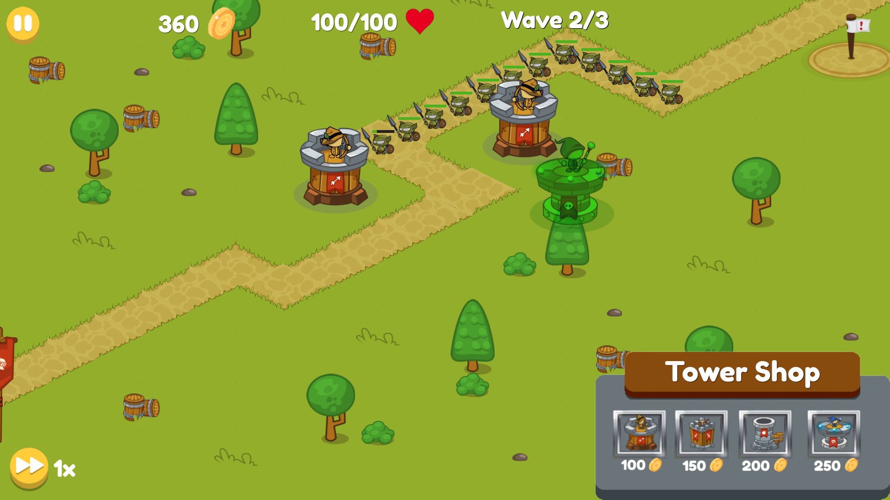

# Medieval Tower Defence Simulator

A 2D tower defence game built in **Godot 4.2** with **GDScript**. Orcs march along a path towards your base. Place archer and wizard towers to stop them before your base runs out of health.



## Play it

**Windows:** download the zip from the [latest release](https://github.com/danzgeorg/godot-tower-defence/releases/latest), unzip it and run `Medieval Tower Defence Simulator.exe`. Keep the `.exe` and `.pck` files in the same folder.

**From source:** install [Godot 4.2](https://godotengine.org/download), open `project.godot` in the editor and press **F5**.

## How to play

| Action | Control |
|---|---|
| Choose a tower | Click Archer or Wizard in the build menu |
| Place the tower | Left-click a green tile (red means you can't build there) |
| Cancel placing | Esc |
| Start the first wave / pause / resume | Pause button |
| Change game speed | Speed button (0.5x to 2x) |

You start with **200 coins** and **100 base health**. Each orc you kill earns 20 coins. Each orc that reaches the end of the path costs 20 health. Survive all **3 waves** to win.

| Tower | Cost | Damage | Fire rate | Range |
|---|---|---|---|---|
| Archer | 100 | 10 | every 0.5s | 500 |
| Wizard | 250 | 25 | every 1.5s | 650 |

## How it works

- **Wave spawning.** Each wave spawns 10 more orcs than the last, half a second apart, with a longer break between each wave. Orcs follow a `Path2D` using `PathFollow2D`.
- **Targeting.** Each tower tracks the enemies inside its range (`Area2D` enter and exit signals) and shoots whichever one is furthest along the path, so the most dangerous enemy is hit first.
- **Placement.** A preview of the tower follows the cursor and snaps to the tile grid. It turns red over the path, decorations or an existing tower, and green where it can be built.
- **Data-driven stats.** Tower damage, fire rate, range and cost live in one autoloaded `GameData` script, so balancing the game means changing a single file.
- **Signals.** Enemies emit `enemyDied` and `baseDamage` signals, and the game scene updates coins, health and the wave counter in response.

## Project structure

```
SceneManager.gd/.tscn   Main menu and switching between menu and game
data/GameData.gd        Tower stats and costs (autoload)
scenes/main_scenes/     Game loop, HUD, level and main menu
scenes/towers/          Shared tower logic (towers.gd) and each tower type
scenes/enemies/         Orc movement, health and damage
assets/                 Sprites, UI, tiles and fonts
```

## What I'd add next

- Tower upgrades (the level 2 archer and wizard scenes already exist but aren't connected yet)
- More enemy types and levels
- Separate win and lose screens, and a working options menu

## Credits

Built by Daniel Georgiev. Font: Fredoka One (SIL Open Font License).
<!-- Credit the sources of any sprites or tiles you didn't make yourself here. -->
